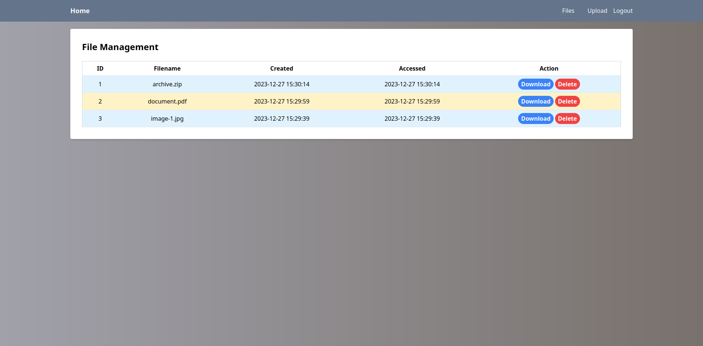

    
    
    
    
    
    
    

## Description

File Vault is a simple, secure file storage service that allows you to upload, download, and delete files.

## API

[API](api) was made using Go, along with the PostgreSQL [database](api/db). Files are stored
in [Localstack S3](api/storage) and are encrypted using AES-256-GCM. For deriving the encryption key from the user
password, Argon2 is used. We additionally added [2FA](api/otp) using TOTP. The 2FA secret key is encrypted using
[RSA-4096](api/pki). We also added our own [TLS certificate](api/cert).

## Website

The [website](website) was made using Laravel. It is a simple web interface for the File Vault API. For login, we used
Github OAuth.

  
   
  <i>Home page.</i>

For additional images, see the [images](images) folder.
